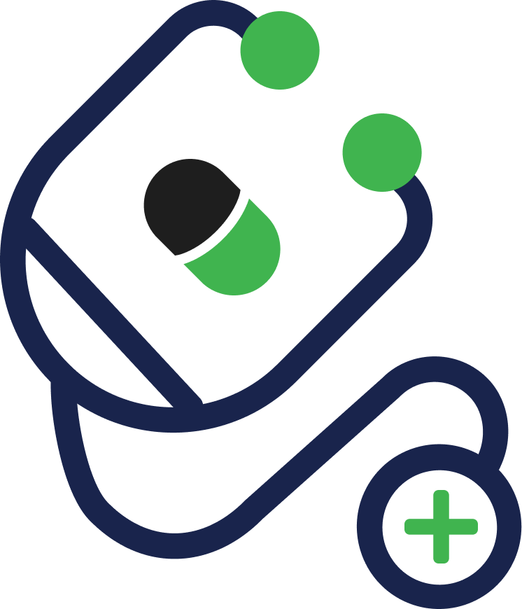

# 🏥 DocDial - Doctor Appointment & Chat System

<div align="center">
  </br>

**A comprehensive mobile application for seamless doctor-patient interaction, appointment booking, and real-time communication.**

[](https://flutter.dev)
[](https://firebase.google.com)
[](https://dart.dev)

</div>

## 🌟 Overview

**DocDial** is a modern, Flutter-based mobile application that revolutionizes the way patients and doctors interact. Built with Firebase as the backend, it provides a seamless platform for appointment booking, real-time chat communication, and comprehensive healthcare management.

### 🎯 Project Goals

-   **Streamline Healthcare Access**: Make it easier for patients to find and book appointments with qualified doctors
-   **Enable Real-time Communication**: Facilitate instant messaging between patients and healthcare providers
-   **Improve Healthcare Management**: Provide doctors with tools to manage their schedules, appointments, and patient interactions
-   **Enhanced User Experience**: Deliver an intuitive, responsive, and accessible mobile application

## ✨ Features

### 👤 For Patients

#### 🔍 **Doctor Discovery & Search**

-   **Advanced Search**: Find doctors by name with intelligent search suggestions
-   **Category-wise Browsing**: Explore doctors by medical specialties:
    -   🫀 Cardiologist
    -   🦷 Dentist
    -   🧒 Pediatrician
    -   🧠 Neurologist
    -   👨‍⚕️ General Practitioner
    -   🔬 Dermatologist
    -   🫁 Gastroenterologist
    -   👂 Otolaryngologist (ENT)
-   **Top-Rated Doctors**: Discover highly-rated healthcare providers
-   **Detailed Profiles**: View comprehensive doctor information including ratings, experience, and location

#### 📅 **Smart Appointment Booking**

-   **Interactive Date Selection**: Choose from available dates with an intuitive calendar interface
-   **Real-time Slot Availability**: View and select from available time slots
-   **Appointment Description**: Add detailed descriptions for your medical concerns
-   **Status Tracking**: Monitor appointment status (Pending, Booked, Completed)
-   **Automatic Updates**: Receive real-time updates on appointment confirmations

#### 💬 **In-App Communication**

-   **Real-time Chat**: Instant messaging with your healthcare providers
-   **Chat History**: Access previous conversations with doctors
-   **Multimedia Support**: Share text messages and communicate effectively

#### ⭐ **Rating & Review System**

-   **Post-Appointment Reviews**: Rate doctors only after completed appointments
-   **Star Rating**: Provide 1-5 star ratings with detailed feedback
-   **Review Management**: View and manage your submitted reviews

#### 📱 **Personal Dashboard**

-   **Appointment Overview**: Quick access to upcoming and past appointments
-   **Health Notifications**: Stay updated with appointment reminders
-   **Profile Management**: Update personal information and preferences

---

### 👨‍⚕️ For Doctors

#### 🏥 **Comprehensive Schedule Management**

-   **Time Slot Control**: Manage available appointment slots dynamically
-   **Holiday Management**: Mark specific days as holidays or unavailable
-   **Offline Booking**: Reserve slots for offline/walk-in patients
-   **Working Hours**: Set and modify opening and closing times
-   **Leave Management**: Mark entire days as leave with one-click booking prevention

#### 📋 **Appointment Management**

-   **Request Dashboard**: View and manage incoming appointment requests
-   **Accept/Decline**: Quick actions for appointment requests with haptic feedback
-   **Swipe Interface**: Intuitive card-based interface for managing requests
-   **Status Updates**: Automatically update appointment statuses based on time
-   **Patient Information**: Access patient details and appointment descriptions

#### 💼 **Professional Profile**

-   **Detailed Profiles**: Showcase qualifications, experience, and specializations
-   **Rating Management**: Monitor patient ratings and reviews
-   **Location Services**: Display practice location with integrated maps
-   **Working Schedule**: Set and display availability to patients

#### 📊 **Analytics & Insights**

-   **Appointment Statistics**: Track appointment history and patterns
-   **Patient Reviews**: Monitor feedback and ratings from patients
-   **Performance Metrics**: View professional performance indicators

---

### 🔧 **Advanced System Features**

#### 🤖 **Intelligent Automation**

-   **Background Processing**: Automatic cleanup of past appointments
-   **Smart Scheduling**: Automatic time slot generation based on working hours
-   **Status Management**: Intelligent appointment status updates
-   **Data Synchronization**: Real-time data sync across all devices

#### 🔐 **Security & Authentication**

-   **Firebase Authentication**: Secure login and registration system
-   **Role-based Access**: Separate interfaces for patients and doctors
-   **Data Protection**: Secure storage of sensitive medical information
-   **Session Management**: Automatic session handling and security

#### 🌐 **Cross-platform Compatibility**

-   **Android Support**: Optimized for Android devices
-   **Responsive Design**: Adaptive UI for different screen sizes
-   **Offline Capability**: Core features available without internet connection
-   **Performance Optimized**: Smooth performance across device ranges

## 🚀 Getting Started

### 📋 Prerequisites

-   **Flutter SDK**: Version 3.5.1 or higher
-   **Dart SDK**: Compatible with Flutter version
-   **Android Studio**: For Android development
-   **Firebase Account**: For backend services
-   **Git**: For version control

### 🛠️ Installation

1. **Clone the Repository**

    ```bash
    git clone https://github.com/mohitooo28/DocDial.git
    cd DocDial
    ```

2. **Install Dependencies**

    ```bash
    flutter pub get
    ```

3. **Firebase Setup**

    - Create a new Firebase project at [Firebase Console](https://console.firebase.google.com)
    - Enable Authentication, Firestore, and Storage
    - Download `google-services.json` and place it in `android/app/`
    - Configure Firebase rules for Firestore and Storage

4. **Configure Dependencies**

    ```bash
    flutter pub deps
    flutter pub run build_runner build
    ```

5. **Run the Application**
    ```bash
    flutter run
    ```

## 📁 Project Structure

```
📦 lib/
├── 🔐 auth/                          # Authentication Module
│   ├── 🔑 login_page.dart            # User login interface
│   ├── 📝 signup_screen.dart         # User registration
│   ├── 🛠️ service/                   # Authentication services
│   │   ├── 📅 booking_manager.dart   # Booking automation
│   │   └── 📍 location_service.dart  # Location handling
│   └── 🧩 widget/                    # Auth UI components
│
├── 👨‍⚕️ doctor/                        # Doctor Module
│   ├── 🏠 doctor_home_page.dart      # Doctor dashboard
│   ├── 📅 doctor_appointment_page.dart # Schedule management
│   ├── 💬 doctor_chatlist_page.dart  # Chat interface
│   ├── 👤 doctor_profile.dart        # Profile management
│   ├── 🔍 doctor_details_page.dart   # Doctor detail view
│   ├── 🧭 doctor_nav_page.dart       # Navigation
│   ├── 📊 model/                     # Data models
│   │   ├── 👨‍⚕️ doctor.dart            # Doctor model
│   │   ├── 👤 patient.dart           # Patient model
│   │   ├── 📅 booking.dart           # Booking model
│   │   └── ⏰ time_info.dart         # Time utilities
│   └── 🧩 widget/                    Doctor UI components
│
├── 👤 patient/                       # Patient Module
│   ├── 🏠 patient_home_page.dart     # Patient dashboard
│   ├── 📅 patient_appointment_page.dart # Appointment management
│   ├── 💬 chat_list_page.dart        # Chat list
│   ├── 👤 patient_profile_page.dart  # Profile settings
│   ├── 🔍 search_page.dart           # Doctor search
│   ├── 📂 doctor_list_category.dart  # Category browsing
│   ├── 🧭 patient_nav_page.dart      # Navigation
│   ├── 📊 model/                     # Data models
│   └── 🧩 widget/                    # Patient UI components
│       ├── 🎴 appointment cards      # Appointment widgets
│       ├── 👨‍⚕️ doctor_card.dart       # Doctor display
│       ├── ⭐ rating components      # Rating system
│       └── 🔧 utility widgets        # Helper widgets
│
├── 🖼️ screens/                       # Shared Screens
│   ├── 🚀 splash_screen.dart         # App launch screen
│   ├── 💬 chat_screen.dart           # Real-time chat
│   └── 🌐 global.dart                # Global state management
│
└── 📱 main.dart                      # Application entry point
```

### 🗂️ Assets Structure

```
📦 assets/
├── 🏷️ category/
│   ├── 🫀 cardiologist.svg
│   ├── 🦷 dentist.svg
│   ├── 🧒 pediatrician.svg
│   └── ... (other specialties)
├── 🖼️ logo/
│   ├── logo.png
│   ├── logo.svg
│   └── logowhite.svg
└── 🎨 vector/
    ├── empty.svg
    └── nothing.svg
```

## 📱 App Screenshots

### 🚀 Welcome & Authentication


<div>
<table>
<tr>
<td align="center">

<br><strong>🌟 Splash Screen</strong>
</td>
<td align="center">

<br><strong>🔐 Login Screen</strong>
</td>
<td align="center">

<br><strong>📝 Registration</strong>
</td>
</tr>
</table>
</div>

### 👤 Patient Interface

<div>
<table>
<tr>
<td align="center">

<br><strong>🏠 Home Screen</strong>
</td>
<td align="center">

<br><strong>🔍 Doctor Search</strong>
</td>
<td align="center">

<br><strong>⚕️ Doctor Profile</strong>
</td>
<td align="center">

<br><strong>📅 Book Appointment</strong>
</td>
</tr>
<tr>
<td align="center">

<br><strong>📅 Upcoming Appointments</strong>
</td>
<td align="center">

<br><strong>⭐ Review & Rating</strong>
</td>
<td align="center">

<br><strong>👤 Chat List</strong>
</td>
<td align="center">

<br><strong>💬 Chats</strong>
</td>
</tr>
</table>
</div>

### 👨‍⚕️ Doctor Interface

<div>
<table>
<tr>
<td align="center">

<br><strong>🏥 Doctor Dashboard</strong>
</td>
<td align="center">

<br><strong>📋 Appointment Management</strong>
</td>
<td align="center">

<br><strong>👤 Doctor Profile</strong>
</td>
</tr>
</table>
</div>

## 📄 License

This project is licensed under the MIT License - see the [LICENSE](LICENSE) file for details.

---

<div align="center">

**Built with ❤️ for seamless healthcare connectivity and modern patient-doctor interaction**

[🌟 Star this repo](../../stargazers) • [🐛 Report Bug](../../issues) • [💡 Request Feature](../../issues)

</div>
